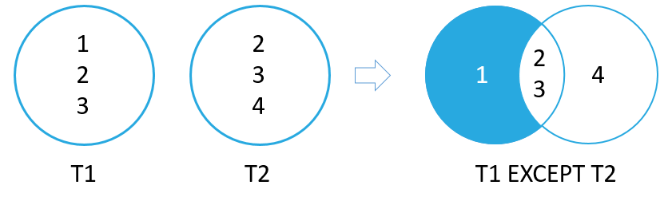

# Except

The `except` operator is similar to `union` except it returns the *set difference* between the two result sets:


*Image: https://www.sqlitetutorial.net/sqlite-except/*

The two `except` queries must result in th same number of columns ad compatible data types.

## Example

Create two tables with the same structure but different values:
```sql
create table t1 (v1 int);
insert into t1 values (1), (2), (3);

create table t2 (v2 int);
insert into t2 values (2), (3), (4);
```

Now, use an `except` query to get the setdiff between `t1` and `t2`:
```sql
select * from t1
union
select * from t2;

v1
--
1
```

`1` is the only value in `t1` but not in `t2`.

### Find all artists who do not have an album in the `albums` table:

Select from the two different tables and form each query so that the the column numbers and data types are the same:

`> sqlite3 tutorial/media.db`
```sql
select artistId from artists
except
select artistId from albums;

ArtistId
--------
25
26
28
29
```