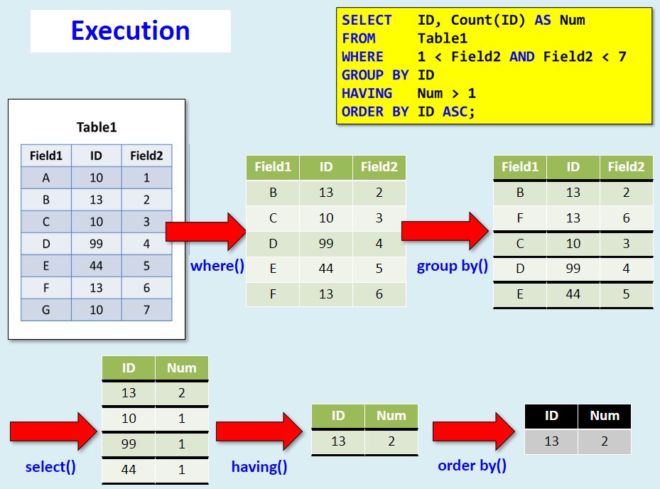

# Select

https://www.sqlitetutorial.net/sqlite-select/

The `select` statement in SQL allows querying of data.

## Complete syntax
```sql
select distinct column_list
from table_list
  join table on join_condition
where row_filter
order by column
limit count offset offset
group by column
having group_filter;
```

## Select distinct
`> sqlite3 tutorial/media.db`
```sql
select distinct city
from customers
order by city;
```

### NULL values with distinct
If there are `NULL` values, a `distinct` query will only return exactly one of them. In other words, `NULL` values are treated like any other value for `select distinct`.

## Relative ordering of `where`, `group by`, `select`, `having`, and `order by`


*Image: CS 310, Prof Hummel*

SQLite syntax for above example:

```sql
create table t (field1 text, id integer, field2 integer);
insert into t values ('A', 10, 1), ('B', 13, 2), ('C', 10, 3), ('D', 99, 4), ('E', 44, 5), ('F', 13, 6), ('G', 10, 7);

select id, count(id) as num
from t
where field2 > 1 and field2 < 7
group by id
having num > 1
order by id asc;

id  num
--  ---
13  2
```
