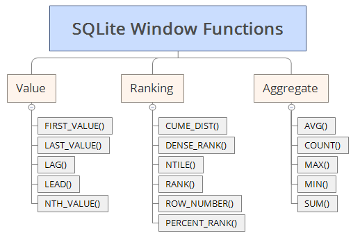

# Window Function

A *window function* performs a calculation across multiple rows in a way that relates to the current row. Window functions are useful for creating running totals and rankings.

### SQLite window functions
SQLite supports these window functions: `cume_dist`, `dense_rank`, `first_value`, `lag`, `last_value`, `lead`, `nth_value`, `ntile`, `percent_rank`, `rank`, `row_number`.

There are three main categories
1. Value
1. Ranking
1. Aggregate

*Image: https://www.sqlitetutorial.net/sqlite-window-functions/*
